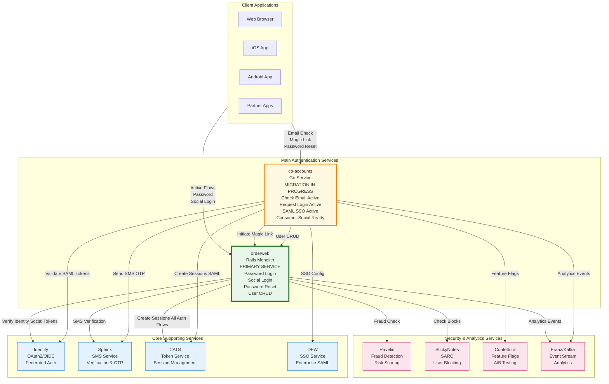

# Authentication Flows Research: orderweb & co-accounts

## Executive Summary

This document maps the authentication architecture across two services that currently serve production traffic in parallel:

**Two Main Services:**
- **orderweb (Rails monolith)**: Legacy service handling the majority of production authentication traffic
  - Password login, consumer social login (Apple, Google, Facebook), password reset, user management
  - Well-established but monolithic architecture
  
- **co-accounts (Go microservice)**: Modern service with partial production deployment
  - Currently handles: Email checking, magic link/SMS OTP initiation, SAML SSO (enterprise)
  - Has infrastructure ready for: Consumer social login, password reset (not yet serving traffic)

**Current State:**
The authentication system is split across both services, with most critical flows still routed through orderweb. Only specific flows have migrated to co-accounts:
- SAML SSO (enterprise): Migrated to co-accounts
- Email discovery and passwordless initiation: Handled by co-accounts
- Final authentication for most methods: Still in orderweb

**Risk and Cost:**
Maintaining parallel authentication systems introduces significant operational challenges:
- **Dual maintenance burden**: Changes must be coordinated across two codebases
- **Split ownership complexity**: Authentication logic distributed between services
- **Testing overhead**: End-to-end flows span multiple services
- **Incident response complexity**: Failures may originate from either service
- **Technical debt accumulation**: co-accounts infrastructure exists but remains unused for some flows
- **Migration risk**: Incomplete migration leaves system in transitional state

**Migration Status**: 
The migration from orderweb to co-accounts is in progress but far from complete. While co-accounts has built-out infrastructure for additional flows (consumer social login, password reset), these remain dormant while production traffic continues through orderweb.

---

## 1. AUTHENTICATION METHODS SUMMARY

### Available Methods (Production)

| Method | Entry Point | Service | Status | Flow |
|--------|-------------|---------|--------|------|
| **Password** | orderweb | orderweb + CATS | ✅ Production | Classic email + password |
| **Magic Link (Email)** | co-accounts → orderweb | orderweb + Identity + CATS | ✅ Production | Passwordless via email with passcode |
| **SMS OTP** | co-accounts → orderweb | orderweb + Sphinx + CATS | ✅ Production | Passwordless via SMS |
| **Apple Sign In** | orderweb | orderweb + Identity + CATS | ✅ Production | OAuth2 federated (consumer) |
| **Google Sign In** | orderweb | orderweb + Identity + CATS | ✅ Production | OAuth2 federated (consumer) |
| **Facebook Classic** | orderweb | orderweb + Identity + CATS | ✅ Production | OAuth2 federated (consumer) |
| **Facebook Limited** | orderweb | orderweb + Identity + CATS | ✅ Production | OAuth2 federated (consumer) |
| **SAML SSO** | co-accounts | co-accounts + Identity + DFW + CATS + orderweb | ✅ Production | Enterprise SSO |

### Available Methods (Future - co-accounts Migration Target)

| Method | Entry Point | Service | Status | Notes |
|--------|-------------|---------|--------|-------|
| **Social Login (Apple/Google/FB)** | co-accounts | co-accounts + Identity + orderweb | 🚧 Ready but not in use | Infrastructure exists, consumer social login migration pending |

---

## 2. ARCHITECTURE OVERVIEW

### 2.1 High-Level Auth Architecture



### 2.2 Key Components

**Main Services:**
- **orderweb (Rails)**: 
  - Status: Primary authentication service for consumers
  - Handles: Password login, password reset, consumer social login (Apple, Google, Facebook), user management, magic link generation
  - Role: Monolithic service handling majority of consumer auth traffic
  
- **co-accounts (Go)**: 
  - Status: Partial migration complete
  - Handles: Email checking, magic link/SMS OTP initiation, SAML SSO (enterprise)
  - Role: Modern microservice gradually taking over auth responsibilities
  - Note: Has infrastructure for consumer social login and password reset but not serving that traffic yet

**Core Services:**
- **Identity**: OAuth2/OIDC provider for federated authentication (Apple, Google, Facebook, SAML)
- **Sphinx**: SMS verification and OTP delivery
- **CATS**: Centralized session token management
- **DFW**: Enterprise SSO (SAML) configuration

**Security & Analytics:**
- **Ravelin**: Real-time fraud detection and risk scoring
- **StickyNotes**: User blocking and systematic risk control (SARC)
- **Confettura**: Feature flags and A/B testing
- **Franz/Kafka**: Event streaming for analytics

### 2.3 Migration Context

**Current State:**
- orderweb handles: Password login, password reset, consumer social login (Apple, Google, Facebook)
- co-accounts handles: Email checking, magic link/SMS OTP initiation, SAML SSO (enterprise)
- Magic link and SMS OTP validation still goes back to orderweb

---

## 3. COMMON FLOWS SUMMARY

### 3.1 New User Sign-Up via Social Login (via orderweb)
```
1. User clicks "Sign in with Apple" on Consumer Web App
2. Consumer Web App → orderweb POST /api/auth/login
   (with federated_token_type=apple_id_token, federated_token=<token>)
3. orderweb → Identity Service: validate Apple token
4. orderweb → CreateUser: create new user account
5. orderweb → Sphinx: check verification if needed
6. orderweb → Sets session cookies
7. orderweb → Franz: publish signup event
8. orderweb → Returns user data
9. Consumer Web App: User logged in
```

### 3.2 Existing User Login via SMS OTP
```
1. User enters email on Consumer Web App
2. Consumer Web App → co-accounts POST /consumer/accounts/check-email
3. co-accounts → orderweb: fetch_user_data (found, has phone number)
4. co-accounts → Returns: registered=true, providers=['email', 'sms']
5. User selects "Send code via SMS"
6. Consumer Web App → co-accounts POST /request-login (primary_mechanism=sms)
7. co-accounts → Confettura: check AuthEmailSMSLoginFlow variant
8. co-accounts → orderweb: fetch_user_data (get phone number)
9. co-accounts → Sphinx: POST /internal/send_code (send SMS OTP)
10. User receives SMS with verification code
11. User enters verification code in Consumer Web App
12. Consumer Web App → orderweb: authenticate with OTP
13. orderweb → Sphinx: validate verification code
14. orderweb → Sets session cookies
15. orderweb → Franz: publish login event
16. orderweb → Returns user data, user logged in
```

### 3.3 Existing User Login via Magic Link
```
1. User enters email on Consumer Web App
2. Consumer Web App → co-accounts POST /check-email
3. co-accounts → orderweb: fetch_user_data (found, has 'email' provider)
4. co-accounts → Returns: registered=true, providers=['email']
5. User clicks "Send magic link"
6. Consumer Web App → co-accounts POST /request-login
7. co-accounts → orderweb: generate_magic_link
8. orderweb → Identity: generate_passcode (15-char alphanumeric)
9. orderweb → AWS SES: send email with magic link URL + passcode
10. User clicks link in email
11. Consumer Web App → orderweb GET /login/magic-link with passcode
12. orderweb → Identity: passcode_authenticate (validate passcode)
13. orderweb → CATS: create_session_token
14. orderweb → Sets session cookies, redirects to app
```

### 3.4 Enterprise User Login via SAML SSO (via co-accounts)
```
1. User enters corporate email on Consumer Web App
2. Consumer Web App → co-accounts POST /check-email
3. co-accounts → DFW: IsSSOEnabledForUser (true)
4. co-accounts → DFW: GetSSOSAMLParam
5. co-accounts → Returns SAML metadata
6. Consumer Web App: Redirect to IdP with SAML request
7. User authenticates at IdP
8. IdP → Redirects to assertion consumer URL with SAML response
9. Consumer Web App → co-accounts POST /consumer/accounts/auth/login (saml_assertion)
10. co-accounts → Identity: validate SAML token
11. co-accounts → orderweb: fetch_user_data or create_user
12. co-accounts → CATS: create_session_token
13. co-accounts → Sets cookies, returns user data
14. Consumer Web App: User logged in
```

### 3.6 Existing User Login via Password
```
1. User enters email + password on Consumer Web App
2. Consumer Web App → orderweb POST /api/auth/login
3. orderweb → Ravelin: score login attempt
4. orderweb → StickyNotes: check user blocks
5. orderweb → Identity/local: verify password
6. orderweb → Check if MFA required
7. If MFA: orderweb → Sphinx: send SMS code, wait for validation
8. orderweb → Sets session cookies
9. orderweb → Franz: publish login event
10. orderweb → Returns user data, user logged in
```

---

## 4. PRODUCTION ENDPOINTS

### 4.1 co-accounts Endpoints

**Migration Status**: co-accounts is partially deployed. It handles discovery/initiation flows and SAML SSO, but most authentication still happens in orderweb.

#### `POST /consumer/accounts/check-email`
**Production Status**: Active, high volume

**Purpose**: Determine available authentication methods for a given email address

**Behavior**:
1. Checks if user's email domain has SSO enabled (via DFW service)
2. If SSO enabled: Returns SAML metadata for redirect
3. If not SSO: Queries orderweb for user account existence
4. Returns available identity providers (`email`, `apple`, `google`, `facebook`, `saml`)
5. Checks if magic links are blocked (via StickyNotes SARC)
6. Publishes analytics event (known/unknown user email entered)

**Response**:
```json
{
  "registered": true,
  "identity_providers": ["email", "google", "apple"],
  "identity_provider_hint": "sign_in_with_google",
  "magic_links": true
}
```

**Dependencies**: orderweb, DFW, StickyNotes, Franz Analytics

---

#### `POST /request-login`
**Production Status**: Active

**Purpose**: Initiate passwordless login via magic link (email) or SMS OTP

**Behavior**:
1. Validates email and primary_mechanism parameter (`email` or `sms`)
2. Checks SSO status (short-circuits if SSO enabled)
3. Fetches user data from orderweb (gets phone number if SMS selected)
4. Checks Confettura feature flag (`AuthEmailSMSLoginFlow`) for cohort assignment
5. Based on mechanism and cohort:
   - **Email**: Calls orderweb to generate and send magic link
   - **SMS**: Calls Sphinx to send OTP to user's phone
6. Implements fallback logic (SMS→email if SMS fails)
7. Publishes analytics events

**Request**:
```json
{
  "email": "user@example.com",
  "primary_mechanism": "sms",
  "is_fallback_option": false
}
```

**Dependencies**: orderweb, Sphinx, Confettura, DFW, Franz Analytics

---

#### `POST /consumer/accounts/auth/login`
**Production Status**: Active for SAML SSO only, consumer social login not active

**Purpose**: Federated login endpoint (Apple, Google, Facebook, SAML)

**Behavior**: 
- SAML SSO (Enterprise): Active - Handles enterprise SAML authentication
  1. Receives `saml_assertion` from Identity Provider
  2. Validates token with Identity service
  3. Fetches or creates user in orderweb
  4. Creates session via CATS
  5. Returns authenticated user
  
- Consumer Social Login (Apple/Google/Facebook): Not active
  - Infrastructure complete but consumer social login still routes to orderweb
  - Migration from orderweb `/api/auth/login` pending

**Request (SAML)**:
```json
{
  "federated_token_type": "saml_assertion",
  "federated_token": "<saml_response>",
  "client_name": "consumer_web_app"
}
```

**Dependencies**: Identity, orderweb, CATS, Franz Analytics

---

#### `POST /consumer/accounts/password-reset` (family of endpoints)
**Production Status**: Infrastructure ready but not active

**Purpose**: Password reset flow - full implementation exists but not serving traffic

**Behavior**:
- `GET /consumer/accounts/password-reset/` - Show password reset form
- `POST /consumer/accounts/password-reset/` - Initiate reset (send email)
- `GET /consumer/accounts/password-reset/entry` - Validate reset token
- `POST /consumer/accounts/password-reset/entry` - Complete reset (update password)

**Note**: Password reset currently served by orderweb `/api/password_reset/`

**Dependencies**: orderweb, Messaging service, Franz Analytics

---

### 4.2 orderweb Endpoints

**Production Status**: Primary authentication service handling majority of production traffic

#### `POST /api/auth/login`
**Production Status**: Active, high volume

**Purpose**: Primary endpoint for password and consumer social login

**Behavior**:
This endpoint handles MULTIPLE authentication methods:

**1. Password Authentication** (when `password` param present):
- Receives email and password
- Validates password against Identity service
- Runs fraud detection (Ravelin)
- Checks user blocks (StickyNotes SARC)
- Determines if MFA required
- If MFA: sends SMS code via Sphinx
- Creates session and sets cookies
- Returns user data

**2. Consumer Social Login** (when `federated_token` param present):
- Receives federated_token_type (`apple_id_token`, `google_id_token`, `facebook_access_token`, `facebook_id_token`)
- Validates token with Identity service
- Extracts user email and profile
- Creates user if doesn't exist
- Sets session cookies
- Returns user data

**Request (Password)**:
```json
{
  "email": "user@example.com",
  "password": "********"
}
```

**Request (Social Login)**:
```json
{
  "federated_token_type": "apple_id_token",
  "federated_token": "eyJhbGciOiJSUzI1NiIsInR5cCI6IkpXVCJ9...",
  "verification_secret": "optional-sphinx-secret"
}
```

**Dependencies**: Identity, Ravelin, StickyNotes, Sphinx, Franz

**Migration Note**: Consumer social login will eventually migrate to co-accounts. SAML SSO has migrated to co-accounts.

---

#### `POST /api/internal/co_accounts/fetch_user_data`
**Production Status**: Active, high volume (~1,609 requests/min)

**Purpose**: Primary user lookup endpoint for co-accounts integration

**Behavior**:
1. Looks up user by email address or user ID
2. Returns comprehensive user data including:
   - User ID and DRN (Deliveroo Resource Name)
   - Email, mobile phone number
   - Registration status (true/false)
   - Employee status
   - Available identity providers (linked accounts)
3. Does NOT authenticate - pure data retrieval

**Response**:
```json
{
  "user_id": 12345,
  "user_drn": "drn:roo:user:gb:12345",
  "email": "user@example.com",
  "mobile": "+44xxxxxxxxx",
  "registered": true,
  "employee": false,
  "providers": ["email", "google", "apple"]
}
```

**Key Insight**: The 1:1 call ratio with check-email validates tight integration - every email check triggers a user lookup.

---

#### `POST /api/internal/co_accounts/create_user`
**Production Status**: Active (sign-ups only)

**Purpose**: Create new user account during sign-up flow

**Behavior**:
1. Validates user data (email, name, password if provided)
2. Checks for duplicate email addresses
3. Creates security principal in Identity service
4. Saves user to database with marketing preferences
5. Sends verification data to Sphinx (if phone provided)
6. Publishes user creation event to Segment analytics
7. Sends fraud detection data to Ravelin
8. Returns newly created user with DRN

**Request**:
```json
{
  "email": "newuser@example.com",
  "first_name": "John",
  "last_name": "Doe",
  "country": "gb",
  "locale": "en",
  "mobile": "+44xxxxxxxxx",
  "marketing_email": true
}
```

**Dependencies**: Identity, Sphinx, Segment, Ravelin

---

#### `POST /api/internal/co_accounts/update_user`
**Production Status**: Active, low volume (~1 request/min)

**Purpose**: Update user details after authentication

**Behavior**:
1. Updates user locale preference
2. Updates last login timestamp
3. Updates device information
4. Minimal traffic confirms it's only called post-authentication, not on every check

**Request**:
```json
{
  "user_id": 12345,
  "locale": "en-GB",
  "tld": "co.uk"
}
```

---

#### `POST /internal/generate_magic_link`
**Production Status**: Active (called by co-accounts)

**Purpose**: Generate passwordless login link and send via email

**Behavior**:
1. Calls Identity service to generate time-limited passcode (15-character alphanumeric)
2. Creates passcode credential in Identity if user doesn't have one
3. Constructs magic link URL with email and passcode
4. Sends email via AWS SES with magic link
5. Passcode valid for limited time (typically 15-30 minutes)
6. Single-use passcode (consumed on successful validation)

**Request**:
```json
{
  "email": "user@example.com",
  "page_in_progress": "login",
  "redirect_path": "/"
}
```

**Dependencies**: Identity service (passcode generation), AWS SES (email delivery)

---

#### `GET /login/magic-link`
**Production Status**: Active

**Purpose**: Validate magic link passcode and authenticate user

**Behavior**:
1. Calls Identity service to validate passcode via `passcode_authenticate`
2. Validates passcode is correct, not expired, and not previously used
3. Creates session token via CATS
1. Extracts passcode from URL parameters
2. Validates passcode with Sphinx service
3. If valid: Creates user session
4. Sets authentication cookies
5. Redirects to specified path or home
6. Passcode is consumed (single-use)

**Query Parameters**:
```
?email=user@example.com&passcode=ABC123&redirect_path=/menu
```

**Dependencies**: Sphinx

---

#### `POST /api/password_reset` (family of endpoints)
**Production Status**: Active

**Purpose**: Password reset flow

**Endpoints**:
- `GET /api/password_reset/` - Show password reset form
- `POST /api/password_reset/` - Initiate reset (send email)
- `GET /api/password_reset/entry` - Validate reset token
- `POST /api/password_reset/entry` - Submit new password

**Behavior**:
1. User requests password reset
2. Validates email exists
3. Creates password reset token
4. Sends reset email via Messaging service with link
5. User clicks link, validates token
6. User submits new password
7. Password updated in Identity service

**Dependencies**: Identity, Messaging service, Franz Analytics

---

### 4.3 Production Traffic Summary

**High-Volume Endpoints:**
- `orderweb POST /api/auth/login` - Primary consumer authentication (password + social login)
- `co-accounts POST /consumer/accounts/check-email` - Auth method discovery (~1,630 req/min)
- `orderweb POST /api/internal/co_accounts/fetch_user_data` - User lookup (~1,609 req/min)
- `co-accounts POST /consumer/accounts/auth/login` - SAML SSO (enterprise only)

**Service Responsibilities (Current Production State):**

| Flow Type | Discovery (co-accounts) | Authentication |
|-----------|------------------------|----------------|
| **Password Login** | Direct to orderweb | orderweb `/api/auth/login` |
| **Password Reset** | Direct to orderweb | orderweb `/api/password_reset/` |
| **Social Login (Apple/Google/FB)** | Check-email returns providers | orderweb `/api/auth/login` with federated_token |
| **SAML SSO (Enterprise)** | Check-email + DFW | co-accounts `/consumer/accounts/auth/login` |
| **Magic Link** | Request-login initiates → orderweb + Identity | orderweb `/login/magic-link` validates via Identity |
| **SMS OTP** | Request-login initiates → Sphinx | orderweb password auth with OTP via Sphinx |

**Migration Status:**
- SAML SSO migrated to co-accounts (enterprise auth)
- Consumer social login and password reset still in orderweb
- co-accounts has infrastructure for consumer social login and password reset but not active

---

## 5. MICROSERVICE DEPENDENCIES & ENDPOINTS

### 5.1 Sphinx (Phone Verification Service)

**Purpose**: SMS verification, OTP, and phone-based authentication

**Endpoints used by orderweb:**
- `POST /verification_secret_usable` - Check if verification secret is valid
- `POST /add_account_to_verification` - Associate account with verification
- `POST /internal/send_code` - Send SMS verification code
- `POST /internal/validate_code` - Validate SMS verification code

**Endpoints used by co-accounts:**
- `POST /verification_secret_usable` - Check secret validity
- `POST /add_account_to_verification` - Link account to verification
- `POST /internal/send_code` - Send SMS OTP

**Authentication**: Basic Auth (username/password)

---

### 5.2 Identity Service

**Purpose**: OAuth2/OIDC identity provider, manages security principals and credentials

**Endpoints used by co-accounts:**
- `POST /o/token/authenticate` - Authenticate federated tokens (Apple/Google/Facebook/SAML)
- `POST /oauth/token` - OAuth2 token endpoint
  - **Production Volume**: ~1 request/min
- `POST /o/oauth/introspect` - Introspect federated tokens
- `POST /v1/security_principals` - Create security principal for user
- `POST /v1/security_principals/{uid}/credentials` - Create password credential
- `DELETE /v1/credentials/{uid}` - Delete credential
- `PATCH /v1/credentials/{uid}` - Update credential
- `GET /id/for/account/drn:roo:user:{country}:{guid}` - Look up user identity by DRN

**Authentication**: Basic Auth (username/password)

**Token Types Supported:**
- `apple_id_token` - Apple Sign In
- `google_id_token` - Google Sign In
- `facebook_access_token` - Facebook Classic Login
- `facebook_id_token` - Facebook Limited Login
- `saml_token` - Enterprise SSO

---

### 5.3 CATS (Consumer Auth Token Service)

**Purpose**: Centralized session token management and authentication for all login flows

**Used By**: 
- **orderweb**: All authentication flows (password, social login, magic link, SMS OTP)
- **co-accounts**: SAML SSO authentication

**Endpoints (gRPC):**
- `CreateToken` - Create new session token for user after successful authentication
- `RefreshToken` - Refresh/validate existing token
- `DeleteToken` - Delete specific token (logout)
- `DeleteTokenInstance` - Delete token instance by hash
- `DeleteAllTokensByUser` - Revoke all tokens for user (e.g., password change)

**Authentication**: gRPC with circuit breaker and retry logic

**Response**: Returns both token (for cookie) and JWT

**Implementation Details:**
- orderweb uses `GrpcServices::CoAuthTokenService` Ruby client
- co-accounts uses Go gRPC client
- Both services call CATS immediately after successful authentication
- Session tokens are stored in cookies and used for subsequent requests

---

### 5.4 DFW (Deliveroo For Work/SSO Association Service)

**Purpose**: Enterprise SSO configuration and management

**Endpoints used by co-accounts (gRPC):**
- `GetSSOSAMLParam` - Get SAML configuration for domain
- Integration with Confettura for SSO enablement flags

**Response Includes:**
- Identity Provider SSO URL
- Identity Provider Issuer
- Service Provider Issuer
- Assertion Consumer Service URL
- Sign AuthN Requests flag
- Client Name

**SSO Flow:**
1. Check if user's email domain has SSO enabled (Confettura flag)
2. Fetch SAML parameters from DFW
3. Generate SAML request
4. Redirect to IdP for authentication
5. Handle SAML response at assertion consumer service URL

---

### 5.5 StickyNotes Service

**Purpose**: User blocking/flagging for security reasons (SARC - Systematic Account Risk Control)

**Endpoints used by orderweb:**
- Check if user has active SARC note (blocks magic links)
- Manage user blocks and risk flags

**Endpoints used by co-accounts:**
- `HasActiveSarcNote(user_drn)` - Check if user is blocked

---

### 5.6 Confettura (Feature Flag Service)

**Purpose**: Feature flags and A/B testing

**Flags used in auth flows:**
- `sms_verification_account_creation` - Enable SMS verification for new accounts
- `disable_employee_password_signup` - Block employee email signup
- `auth_email_sms_login_flow` - Determine email vs SMS login flow
- `dfw-sso` (namespace: dfw) - Enable SSO for specific domains

**Integration**: Actor-based feature flags with user/request context

---

### 5.7 Ravelin (Fraud Detection Service)

**Purpose**: Real-time fraud detection and risk scoring

**Used in orderweb:**
- `Purchasing::Ravelin::CheckoutService` - Score authentication attempts
- Track login attempts, device fingerprints, behavioral signals
- Block high-risk authentication attempts

**Integration**: HTTP API with transaction scoring

---

### 5.8 Franz/Kafka (Event Streaming)

**Purpose**: Event publishing for analytics and downstream services

**Events published during auth:**
- `ConsumerKnownUserEmailEntered` - Existing user entered email
- `ConsumerUnknownUserEmailEntered` - New user entered email
- `VerificationCodeSendAttempted` - SMS OTP send attempted
- `MagicLinkLoginEmailSent` - Magic link email sent
- `MagicLinkLoginEmailFailed` - Magic link email failed
- Login success/failure events with metadata

**Integration**: Kafka producer through Franz client

---

### 5.9 Messaging Service

**Purpose**: Email delivery for transactional emails

**Used for:**
- Magic link emails
- Password reset emails
- Welcome emails
- Verification emails

---

## 6. KEY SECURITY CONTROLS

### 6.1 Fraud Detection (Ravelin)
- All password logins scored by Ravelin
- Device fingerprinting
- Behavioral analysis
- Risk-based blocking

### 6.2 Account Blocking (StickyNotes)
- SARC notes block magic link authentication
- Systematic risk control
- Admin-managed blocks

### 6.3 Rate Limiting (Sphinx)
- SMS OTP rate limiting
- Verification cap per phone number
- Prevents abuse of verification system

### 6.4 MFA (Multi-Factor Authentication)
- SMS-based MFA for high-risk logins
- Forced MFA for certain user segments
- Challenges issued via Sphinx

### 6.5 Account Takeover Detection (Beancounter)
- Monitors for suspicious login patterns
- Triggers additional verification steps
- Integrated into password authentication flow

### 6.6 Session Management (CATS)
- Secure session token generation
- Token rotation on refresh
- Device-based token management
- Ability to revoke all sessions

---

## 7. APPENDIX: DETAILED FLOW DIAGRAMS

### 7.1 Sign-Up Call Graph (orderweb)

```
RegistrationController#register
  └─> CreateUser.call() [Interactor Organizer]
      ├─> CreateUser::TrackSignUpFailures
      ├─> CreateUser::CheckVerification
      │   └─> Sphinx::Service.check_secret_usable()
      │       └─> Sphinx::ApiClient → Sphinx microservice
      │           Endpoint: POST /verification_secret_usable
      ├─> CreateUser::InitUser
      ├─> CreateUser::SetMarketingPreferences
      ├─> CreateUser::ValidateUser
      ├─> CreateUser::CreateSecurityPrincipal
      ├─> CreateUser::SaveUser
      ├─> CreateUser::SendToCustomerPhoneVerification
      ├─> CreateUser::SendToSphinx
      │   └─> Sphinx::Service.send_account_identifier()
      │       └─> Sphinx::ApiClient → Sphinx microservice
      │           Endpoint: POST /add_account_to_verification
      ├─> CreateUser::SendToSegment
      │   └─> Analytics::SegmentService (Tracking)
      └─> CreateUser::SendToRavelin
          └─> Purchasing::Ravelin::CheckoutService (Fraud detection)
```

### 7.2 Password Login Call Graph (orderweb)

```
Api::AuthController#perform_login
  └─> AuthenticateUser.authenticate_with_password()
      ├─> AuthenticateUserPassword.call()
      │   ├─> AuthenticateUserPassword::FindUser
      │   ├─> AuthenticateUserPassword::CheckForStrictPassword
      │   ├─> AuthenticateUserPassword::CheckRavelin
      │   │   └─> Purchasing::Ravelin::CheckoutService
      │   │       Purpose: Fraud detection and risk scoring
      │   ├─> AuthenticateUserPassword::CheckStickynotes
      │   │   └─> StickyNotes::IdentifierService
      │   │       Purpose: Check if user is blocked/flagged
      │   ├─> AuthenticateUserPassword::BeancounterATO
      │   │   Purpose: Account takeover detection
      │   ├─> AuthenticateUserPassword::ForceUserToMfa
      │   │   Purpose: Determine if MFA challenge required
      │   └─> AuthenticateUserPassword::AuthenticateWithIdentity
      │       Purpose: Verify password credentials
      └─> LogAuthenticationResult.call()
          └─> LogAuthenticationResult::PublishToFranz
              Purpose: Publish login event to Kafka
```

### 7.3 Federated Sign-Up Call Graph (co-accounts)

```
FederatedLoginHandler.Handle()
  └─> FederatedLoginService.Login()
      ├─> Authenticator.Authenticate()
      │   ├─> Identity Service (gRPC)
      │   │   ├─> POST /o/token/authenticate
      │   │   │   (Validates Apple/Google/Facebook/SAML tokens)
      │   │   └─> POST /o/oauth/introspect
      │   │       (Introspects federated tokens)
      │   ├─> Orderweb Service (HTTP)
      │   │   ├─> POST /api/internal/co_accounts/fetch_user_data
      │   │   │   Purpose: Fetch existing user by email
      │   │   ├─> POST /api/internal/co_accounts/create_user
      │   │   │   Purpose: Create new user if doesn't exist
      │   │   └─> POST /api/internal/co_accounts/update_user
      │   │       Purpose: Update user details
      │   └─> Sphinx Service (HTTP)
      │       └─> POST /verification_secret_usable
      │           Purpose: Validate phone verification if required
      ├─> SessionAuthenticator.Login()
      │   └─> CATS Service (gRPC)
      │       └─> CreateSessionToken()
      │           Purpose: Create authentication session token
      ├─> CookieService.SetLogonCookie()
      ├─> CookieService.SetUserCookie()
      ├─> CookieService.SetLocaleCookie()
      ├─> CookieService.SetStickyGUIDCookie()
      └─> Orderweb Service
          └─> POST /api/internal/co_accounts/update_user
              Purpose: Update user locale preferences
```
