# Argo Search Framework Guide

A comprehensive guide to understanding the Argo Search framework used by Feed in Pedregal for content retrieval, ranking, and discovery.

---

## Table of Contents
1. [What is Argo Search?](#what-is-argo-search)
2. [Architecture Overview](#architecture-overview)
3. [Key Concepts](#key-concepts)
4. [Request Structure](#request-structure)
5. [Namespaces & Pipelines](#namespaces--pipelines)
6. [Integration with Feed](#integration-with-feed)
7. [Query Building](#query-building)
8. [Response Handling](#response-handling)
9. [Common Patterns](#common-patterns)

---

## What is Argo Search?

**Argo Search** is DoorDash's internal search and retrieval infrastructure. It provides:

- **Distributed Search**: Scalable search across millions of documents (stores, items, collections)
- **Configurable Pipelines**: ML-powered ranking, filtering, and reordering stages
- **Geo-aware Retrieval**: Location-based search with distance calculations
- **Real-time Results**: Low-latency retrieval for consumer-facing applications

In the Feed context, Argo is the **primary retrieval mechanism** for getting store and item candidates during feed generation.

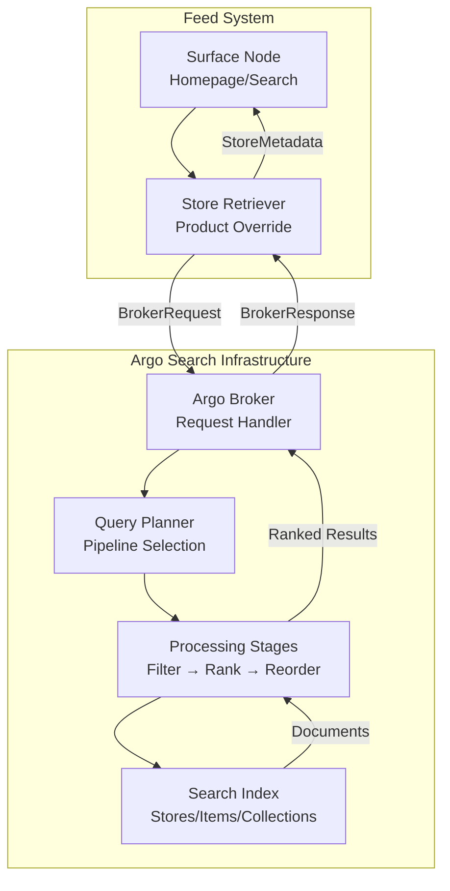

---

## Architecture Overview

### High-Level Components

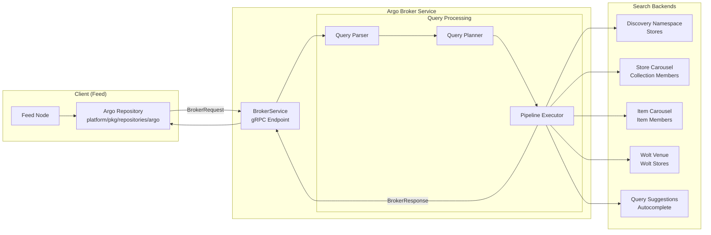

### Component Responsibilities

| Component | Description |
|-----------|-------------|
| **Broker Service** | gRPC endpoint accepting search requests |
| **Query Planner** | Selects and configures the processing pipeline |
| **Pipeline** | Sequence of stages (filtering, ranking, reordering) |
| **Namespace** | Logical grouping of documents (stores, items, etc.) |
| **Index** | Searchable document store with geo support |

---

## Key Concepts

### Namespace

A **namespace** defines what type of documents you're searching:

| Namespace | Description | Use Case |
|-----------|-------------|----------|
| `discovery` | Main store index for DoorDash | Homepage store retrieval |
| `store_carousel` | Pregenerated store collections | Collection member retrieval |
| `item_carousel` | Pregenerated item collections | Item carousel members |
| `wolt_venue` | Wolt venue index | Wolt homepage/search |
| `query_suggestions` | Autocomplete suggestions | Search autocomplete |
| `retail_item` | Retail/grocery items | New vertical items |

### Pipeline

A **pipeline** is a named sequence of processing stages:

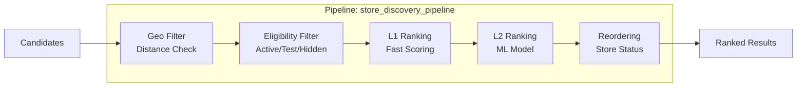

Common pipelines:
- `store_discovery_pipeline` - Homepage store discovery
- `global_search_store_vertical` - Global search stores
- `pipeline_v1` - Wolt venue retrieval
- Autocomplete pipelines for query suggestions

### Context Features

**Context features** provide dynamic parameters for each request:

```go
map[string]*querypb.ContextFeatureValue{
    "user_lat":          {DoubleValue: 37.7749},
    "user_lon":          {DoubleValue: -122.4194},
    "asap_delivery_ts":  {LongValue: 1706000000000},
    "asap_pickup_ts":    {LongValue: 1706000000000},
    "experience":        {StringValue: "doordash"},
}
```

### Planner Context

**Planner context** provides configuration for the pipeline stages:

```go
map[string]*typespb.PayloadValue{
    "consumer_lat":      {DoubleValue: 37.7749},
    "consumer_lon":      {DoubleValue: -122.4194},
    "district":          {LongValue: 1234},
    "submarket_id":      {LongValue: 5678},
    "timezone":          {StringValue: "America/Los_Angeles"},
    "is_pickup":         {BoolValue: false},
    "experience":        {StringValue: "doordash"},
}
```

---

## Request Structure

### BrokerRequest Anatomy

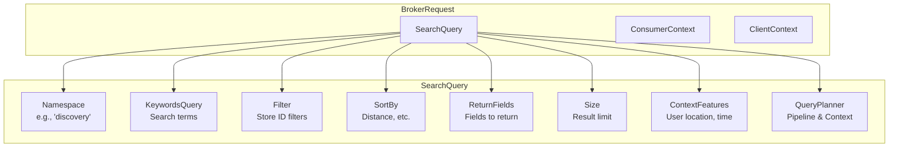

### Code Example: Building a Request

```go
// ArgoQueryConfig defines the static configuration for a search
type ArgoQueryConfig struct {
    Namespace    string           // "discovery", "store_carousel", etc.
    Experience   string           // "doordash", "wolt"
    Pipeline     string           // "store_discovery_pipeline"
    ReturnFields []string         // Fields to return in documents
    Size         int32            // Max results
    StoreIds     []int64          // Optional: filter to specific stores
    Query        string           // Search keywords (for search surfaces)
}

// Build the broker request
request := &argopb.BrokerRequest{
    SearchQuery: &querypb.SearchQuery{
        Namespace:     "discovery",
        KeywordsQuery: buildKeyWordsQuery(queryConfig),
        Filter:        buildStoreIdFilter(queryConfig.StoreIds),
        SortBy: []*querypb.SortField{
            {
                Field:        "arc_distance_between_store_user",
                DefaultValue: math.MaxFloat64,
                SortOrder:    querypb.SortOrder_SORT_ORDER_ASCENDING,
            },
        },
        ReturnFields:    queryConfig.ReturnFields,
        Size:            queryConfig.Size,
        ContextFeatures: contextFeatures,
        QueryPlanner: &querypb.QueryPlanner{
            Pipeline: queryConfig.Pipeline,
            Context:  plannerContext,
        },
    },
    ConsumerContext: &consumerpb.ConsumerContext{
        ConsumerId:  consumerId,
        DdSessionId: sessionId,
        DdDeviceId:  deviceId,
    },
    ClientContext: &clientpb.ClientContext{
        ClientId:  "pedregal_feed",
        UseCaseId: "discovery/store_discovery_feed",
    },
}
```

---

## Namespaces & Pipelines

### DoorDash Namespaces

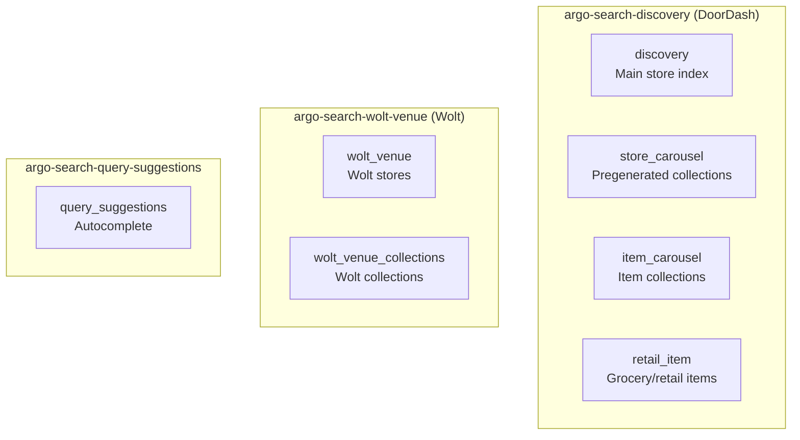

### Namespace Configuration by Surface

| Surface | Namespace | Pipeline | Description |
|---------|-----------|----------|-------------|
| Homepage (DD) | `discovery` | `store_discovery_pipeline` | Store retrieval |
| Homepage (Wolt) | `wolt_venue` | `pipeline_v1` | Venue retrieval |
| Global Search (DD) | `store` | `global_search_store_vertical` | Search stores |
| Global Search (Wolt) | `wolt_venue` | `pipeline_v1` | Search venues |
| Autocomplete | `query_suggestions` | Various | Query suggestions |
| Collection Members | `store_carousel` | N/A | Pregenerated stores |
| Item Collections | `item_carousel` | N/A | Pregenerated items |

---

## Integration with Feed

### Store Retrieval Flow

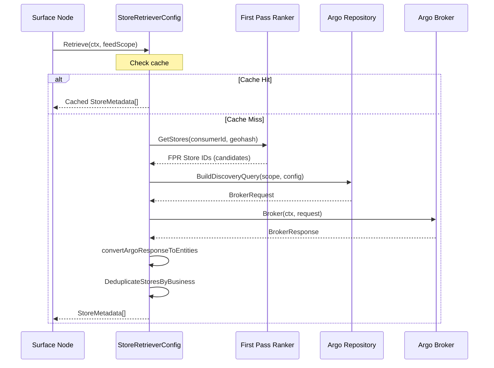

### Code Location in Feed

```
nodes/consumer/feed/
├── platform/pkg/repositories/argo/
│   ├── argo.go                      # Core query building
│   ├── constants.go                 # Field names, context keys
│   ├── store_metadata_converter.go  # Response → StoreMetadata
│   └── converters/
│       └── efs_filters.go           # Filter context conversion
│
├── surface/homepage/productoverrides/restaurants/storeretrieve/
│   └── config.go                    # Homepage DD store retrieval
│
├── surface/homepage/wolt/productoverrides/restaurants/storeretrieve/
│   └── config.go                    # Homepage Wolt store retrieval
│
├── surface/search/global/productoverrides/restaurants/storeretrieve/
│   ├── config.go                    # Global search DD
│   └── wolt/config.go               # Global search Wolt
│
└── platform/pkg/collection/impl/retriever/pregenerated/
    ├── store_member_retriever.go    # Collection store members
    └── item_member_retriever.go     # Collection item members
```

---

## Query Building

### Helper Functions

The Argo repository provides several helper functions for building requests:

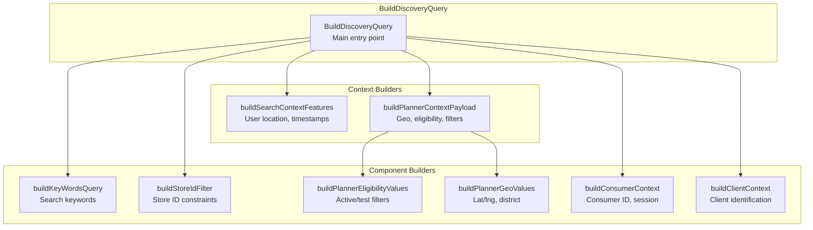

### Common Context Features

| Feature Key | Type | Description |
|-------------|------|-------------|
| `user_lat` / `user_lon` | Double | Consumer location |
| `asap_delivery_ts` | Long | Current timestamp (millis) |
| `asap_pickup_ts` | Long | Current timestamp (millis) |
| `experience` | String | "doordash" or "wolt" |
| `consumer_id` | Long | Consumer identifier |
| `district` | Long | District ID |
| `submarket_id` | Long | Submarket ID |
| `timezone` | String | e.g., "America/Los_Angeles" |

### Return Fields

Common fields returned from the `discovery` namespace:

```go
ReturnFields: []string{
    // Identifiers
    "store_id", "business_id", "name",
    
    // Classification
    "tier_level", "price_range", "business_vertical_id",
    "vertical_ids", "primary_vertical_ids",
    
    // Location
    "location", "delivery_radius_circle",
    
    // Eligibility
    "is_consumer_subscription_eligible", "is_partner",
    "is_snap_eligible", "is_hsa_fsa_eligible",
    "offers_pickup", "hide_from_homepage_list",
    
    // Pricing
    "starting_point", "avg_subtotal_per_person",
    "saf_st_price_inflation_rate",
    
    // Other
    "brand_business_group_id", "catering",
}
```

---

## Response Handling

### BrokerResponse Structure

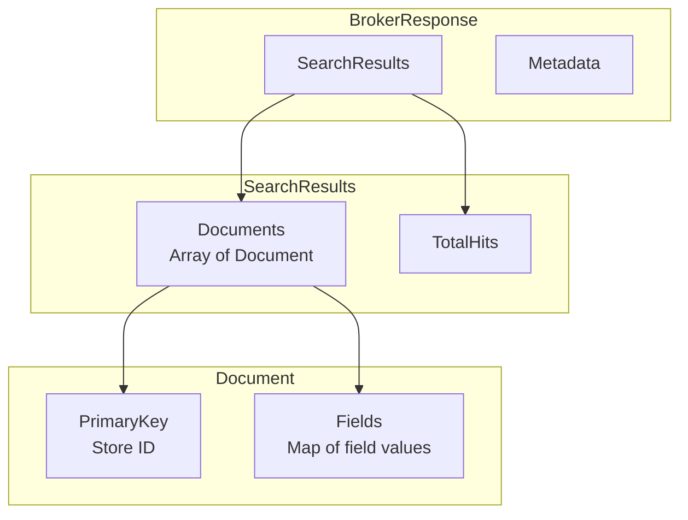

### Converting Response to StoreMetadata

```go
// MapArgoDocumentToStore converts Argo Documents to StoreMetadata
func MapArgoDocumentToStore(documents []*srpb.Document) ([]types.StoreMetadata, error) {
    return lo.Map(documents, func(document *srpb.Document, _ int) types.StoreMetadata {
        businessID := document.GetFields()["business_id"].GetLongValue()
        location := document.GetFields()["location"].GetFieldValueList().GetFieldValue()
        
        return types.StoreMetadata{
            ID:                          types.StoreId(document.PrimaryKey),
            Name:                        document.GetFields()["name"].GetStringValue(),
            BusinessID:                  &businessID,
            IsStoreSubscriptionEligible: document.GetFields()["is_consumer_subscription_eligible"].GetStringValue() == "t",
            Location: types.StoreLocation{
                Lat: location[0].GetDoubleValue(),
                Lng: location[1].GetDoubleValue(),
            },
            StoreVerticalIDs:        extractIntList(document.GetFields()["vertical_ids"]),
            StorePrimaryVerticalIDs: extractIntList(document.GetFields()["primary_vertical_ids"]),
        }
    })
}
```

---

## Common Patterns

### Pattern 1: Homepage Store Retrieval

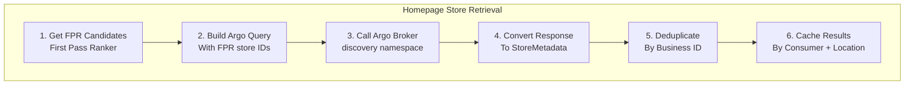

**Key Points:**
- Uses FPR (First Pass Ranker) to get initial candidate store IDs
- Passes candidate IDs to Argo for final filtering and ranking
- Caches results by consumer ID + location

### Pattern 2: Collection Member Retrieval

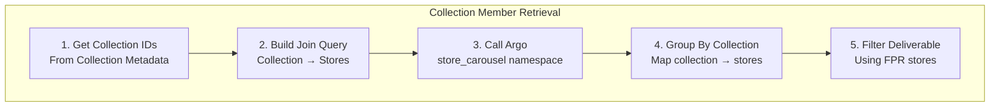

**Key Points:**
- Uses `store_carousel` or `item_carousel` namespace
- Groups results by collection ID
- Filters using deliverable stores from FPR

### Pattern 3: Wolt Venue Search

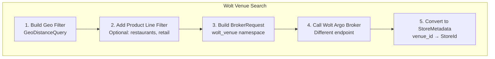

**Key Points:**
- Uses separate Argo cluster for Wolt (`argo-search-wolt-venue-broker`)
- Requires API key authentication
- Uses `GeoDistanceQuery` for radius filtering

### Pattern 4: Query Suggestions (Autocomplete)

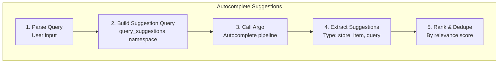

---

## Configuration & Clients

### gRPC Client Configuration

```go
// DoorDash Discovery Argo Client
argoClient argopb.BrokerServiceAsyncClient `gr:"authority=argo-search-discovery-broker.service.prod.ddsd,metadata={dd-api-secret:(vault 'feed/ARGO_SEARCH_DISCOVERY_FEED_API_KEY/ARGO_SEARCH_DISCOVERY_FEED_API_KEY')},attemptDelay=[0ms;30ms;60ms],retryCodes=[ABORTED;UNAVAILABLE;DEADLINE_EXCEEDED]"`

// Wolt Venue Argo Client
argoClient argopb.BrokerServiceAsyncClient `gr:"host=argo-search-wolt-venue-broker.insecure-svc.prod-wolt.doordash.red,port=50051,metadata={dd-api-secret:(vault 'feed/ARGO_SEARCH_DISCOVERY_WOLT_FEED_API_KEY/ARGO_SEARCH_DISCOVERY_WOLT_FEED_API_KEY')}"`
```

### Environment-Specific Handling

```go
// Select client based on environment
var argoClient argopb.BrokerServiceAsyncClient
if guardian.IsLocal() {
    argoClient = s.argoClientLocal  // Uses devbox tunnel
} else {
    argoClient = s.argoClient       // Production/Sandbox
}
```

---

## Debugging & Observability

### Logging Patterns

```go
// Log request building
feedScope.Logger().Info(ctx, "store_retrieval.build_discovery_query.success", 
    log.Any("namespace", "discovery"),
    log.Any("pipeline", "store_discovery_pipeline"),
    log.Any("size", defaultDocRetrievalSize))

// Log response
feedScope.Logger().Info(ctx, "store_retrieval.argo_response.received",
    log.Any("doc_count", len(argoResponse.SearchResults.Documents)),
    log.Any("total_hits", argoResponse.SearchResults.TotalHits))

// Log errors
feedScope.Logger().Error(ctx, "store_retrieval.convert_response.error",
    log.Any("error", err.Error()))
```

### Key Metrics

- **Latency**: Time from request to response
- **Document Count**: Number of results returned
- **Cache Hit Rate**: Effectiveness of result caching
- **Error Rate**: Failed Argo calls

---

## Summary

### Quick Reference

| Concept | Description |
|---------|-------------|
| **Argo** | DoorDash's distributed search infrastructure |
| **Broker** | gRPC service accepting search requests |
| **Namespace** | Document type (discovery, store_carousel, etc.) |
| **Pipeline** | Processing stages (filter → rank → reorder) |
| **Context Features** | Dynamic request parameters (location, time) |
| **Planner Context** | Pipeline configuration (eligibility, geo) |

### Common Namespaces

| Namespace | Content | Used By |
|-----------|---------|---------|
| `discovery` | DoorDash stores | Homepage, Search |
| `wolt_venue` | Wolt venues | Wolt Homepage, Search |
| `store_carousel` | Pregenerated store collections | Collection members |
| `item_carousel` | Pregenerated item collections | Item collections |
| `query_suggestions` | Autocomplete | Search autocomplete |

### Key Files

| File | Purpose |
|------|---------|
| `platform/pkg/repositories/argo/argo.go` | Core query building |
| `platform/pkg/repositories/argo/constants.go` | Field and context keys |
| `platform/pkg/repositories/argo/store_metadata_converter.go` | Response conversion |
| `surface/*/storeretrieve/config.go` | Surface-specific retrieval |

---

## Related Documentation

- [Feed Onboarding Guide](./PEDREGAL_FEED_ONBOARDING.md) - Feed system overview
- [Feed Terminology](https://github.com/doordash/pedregal/blob/main/nodes/consumer/feed/docs/reference/terminology.md)
- [Argo Search Discovery Configs](https://github.com/doordash/argo-search/tree/master/configurations/discovery)

---

*Generated from Pedregal Feed codebase analysis. Last updated: January 2026.*
