# Feed System Onboarding Guide

A comprehensive guide for engineers new to the Pedregal Feed domain. This document explains the architecture, key concepts, data models, and orchestration flow with visual diagrams.

---

## Table of Contents
1. [What is Feed?](#what-is-feed)
2. [High-Level Architecture](#high-level-architecture)
3. [Key Concepts](#key-concepts)
4. [Feed Data Model (FDM)](#feed-data-model-fdm)
5. [Orchestration Pipeline](#orchestration-pipeline)
6. [Directory Structure](#directory-structure)
7. [Getting Started](#getting-started)

---

## What is Feed?

**Feed** is the system that powers the content discovery experience in consumer apps (DoorDash, Wolt, Deliveroo). It's responsible for:

- **Retrieval**: Getting candidate content from various data sources
- **Ranking**: Ordering content based on relevance, personalization, and business rules
- **Blending**: Merging content from multiple products into a unified experience
- **Hydration**: Enriching content with additional metadata (images, badges, pricing)

Think of Feed as the "brain" that decides **what content to show** and **in what order** when a user opens the app.


---

## High-Level Architecture

The Feed system is built on **Graph Runner (GR)**, Pedregal's compute platform. The architecture follows a clear separation of concerns:


### Architecture Layers Explained

| Layer | Responsibility | Example |
|-------|---------------|---------|
| **Surface** | API endpoints that serve feed content | Homepage, Global Search |
| **Platform** | Core infrastructure (orchestration, blending, hydration) | Feed Orchestrator |
| **Product** | Feature-specific logic owned by product teams | Restaurants, Ads, DashPass |

---

## Key Concepts

### Surface vs Product

This is the **most important concept** to understand:


| Concept | Definition | Ownership | Examples |
|---------|------------|-----------|----------|
| **Surface** | A webpage/endpoint that serves feed content. Maps 1:1 with a Graph Runner node. | Single endpoint | Homepage, Global Search, Store Page |
| **Product** | A set of features defining a user experience. Spans multiple surfaces. | Single product team | Restaurants, New Verticals, Ads, Promotions |

### Key Verbs (Actions)


| Verb | Scope | Description |
|------|-------|-------------|
| **Fetch** | Product | Complete pipeline: retrieve → rank → prune |
| **Retrieve** | Product | Get unordered content from data sources |
| **Rank** | Product | Sort content within a single product |
| **Prune** | Product | Remove content not meeting quality thresholds |
| **Blend** | Surface | Merge content from multiple products together |
| **Hydrate** | Surface | Add media/text evidences after blending |
| **Postprocess** | Collection | Re-order collection members after blending |

### Ownership Rules

```mermaid
flowchart TB
    subgraph "Surface Responsibilities"
        S1[Fetches all products]
        S2[Blends feed units]
        S3[Hydrates feed units]
    end
    
    subgraph "Product Responsibilities"
        P1[Fetches feed units]
        P2[Owns retrieve → rank → prune]
        P3[Fetches evidences]
    end
    
    subgraph "Collection Responsibilities"
        C1[Fetches members]
        C2[Can rank/prune members]
    end
    
    S1 --> P1
    S2 --> P3
    P1 --> C1
```



---

## Feed Data Model (FDM)

The FDM defines **what** to display (content), while Presentation Gateway decides **how** to display it (styling, translations).

### FDM Hierarchy


### Core Data Models Explained

#### 1. Feed
A **vertically scrollable view** containing FeedUnits (Collections, Entities, or Placements).

#### 2. Collection
A **container** for homogeneous content (all same type):

```mermaid
flowchart TB
    subgraph "Collection Example: Petco Store Items"
        CollMeta["📋 Metadata<br/>Title: 'Petco Pet Supplies'<br/>ID: carousel-123"]
        TopEntity["🏪 Top-Level Entity<br/>Petco Store<br/>(provides store context)"]
        Members["📦 Members<br/>Item 1: Dog Food<br/>Item 2: Cat Toys<br/>Item 3: Fish Tank"]
    end
    
    CollMeta --> TopEntity
    TopEntity --> Members
```



**Nested Collection Example:**
```
Level 0: "Top Savings" Collection
  └── Level 1: Store Collections (Walmart, Target)
       └── Level 2: Item Collections ("Drinks Deals", "Produce Deals")
            └── Items (Coca-Cola, Apples)
```

#### 3. Entity
The **actual content users engage with** (stores, items, filters).

| Entity Type | Description | Example |
|-------------|-------------|---------|
| Store | Physical merchant location | McDonald's, Walmart |
| Item | Product or menu item | Big Mac, Cat Food |
| Filter | Navigation/filtering option | "Pizza", "Healthy", "$$" |

#### 4. Evidence
**Additional metadata** attached to entities:

| Evidence Type | Examples | Purpose |
|---------------|----------|---------|
| **Media** | Store image, item photo, video | Visual content |
| **Text** | "2.1 mi", "25-35 min", "$0 delivery" | Contextual info for decisions |

```mermaid
flowchart LR
    subgraph "Store Entity with Evidence"
        Store[🏪 McDonald's]
        
        subgraph "Media Evidence"
            M1[Store Image]
            M2[Logo]
        end
        
        subgraph "Text Evidence"
            T1[📍 2.1 mi]
            T2[⏱️ 25-35 min]
            T3[💰 $0 delivery]
            T4[⭐ 4.5 rating]
        end
    end
    
    Store --> M1
    Store --> M2
    Store --> T1
    Store --> T2
    Store --> T3
    Store --> T4
```



#### 5. Placement
**App-specific content containers** (not real-world entities):

| Type | Description |
|------|-------------|
| Spotlight | Promotional banner with featured content |
| Banner | Marketing campaigns, announcements |
| Functional | Navigation aids, filters |

---

## Orchestration Pipeline

The complete flow of how a feed request is processed:


### Pipeline Steps

| Step | Owner | Input | Output |
|------|-------|-------|--------|
| 1. **Retrieve** | Product | Data sources | Unordered candidates |
| 2. **Rank** | Product | Candidates | Ordered candidates |
| 3. **Prune** | Product | Ordered candidates | Quality-filtered list |
| 4. **Blend** | Surface | All product results | Unified feed |
| 5. **Hydrate** | Surface | Blended feed | Feed with evidences |
| 6. **Postprocess** | Collection | Collection members | Final member order |

---

## Directory Structure


### Directory Responsibilities

| Directory | Purpose | Key Files |
|-----------|---------|-----------|
| `platform/` | Core infrastructure shared by all | Orchestrator, Blender, Hydrator |
| `platform/pkg/` | Public APIs for products/surfaces | Scope, Repositories, Override |
| `product/` | Product-specific logic | Retrievers, Rankers, Pruners |
| `product/*/internal/` | Private business logic | DV evaluation, filtering |
| `product/*/pkg/feed/` | FetcherConfig component | Entry point for orchestration |
| `product/*/pkg/override/` | Surface customization hooks | Config structs |
| `surface/` | GR Nodes (API endpoints) | One per feed endpoint |
| `surface/*/node.go` | Main GR Node implementation | Request handler |
| `surface/*/orchestration/` | Surface-specific orchestration | Scope, Blender |
| `surface/*/productoverrides/` | Surface-specific product configs | Restaurant config for Homepage |
| `surface/*/app/` | App-specific providers | DoordashProvider, WoltProvider |

### Import Rules

```mermaid
flowchart TB
    Surface["Surface<br/>(node.go)"] -->|Can import| Platform
    Surface -->|Can import| ProductPkg["Product pkg/"]
    
    Product["Product<br/>(internal/)"] -->|Can import| Platform
    Product -->|⚠️ Limited| OtherProductPkg["Other Product pkg/<br/>(minimize cross-deps)"]
    
    Platform["Platform<br/>(internal/)"] -->|Cannot import| Product
    Platform -->|Cannot import| Surface
    
    style Platform fill:#e1f5fe
    style Product fill:#fff3e0
    style Surface fill:#e8f5e9
```



---

## Getting Started

### Prerequisites

1. **Onboard to Pedregal**: Follow the [setup guide](https://github.com/doordash/pedregal/blob/main/docs/welcome/0-start-here.md)
2. **Learn Graph Runner**: Read the [GR Overview](https://github.com/doordash/pedregal/blob/main/docs/graph-runner/graph-runner-overview.md)

### Run Your First Feed Graph

```bash
# 1. Set up devbox tunnel (requires Tailscale VPN)
devbox tunnel -c usw2

# 2. Download DV configurations
devbox runtime-dv

# 3. List available feed graphs
bazel run //:graphs list 'feed*'

# 4. Run the homepage graph (with relaxed timeouts)
CONFIGPATH=$PWD/nodes/consumer/feed/config.json bazel run //:graphs feed-v2-discovery-get-homepage-feed

# 5. In another terminal, send a test request
./nodes/consumer/feed/scripts/local_test/feed_v2_discovery_get_homepage_feed.sh
```

### Run Guardian Tests

```bash
# Run E2E tests for a specific graph
bazel run graphs test feed-v2-discovery-get-homepage-feed

# Run all feed tests
bazel run graphs -- test 'feed*'
```

### Deploy to Sandbox

1. Open [Spinnaker](https://spinnaker.doordash.team/#/search?q=feed-v2)
2. Select your graph pipeline (e.g., `feed-v2-discovery-get-homepage-feed`)
3. Start Manual Execution → SandboxDeploy
4. Configure: `sandbox_name`, `git_sha`, `usw2`

---

## Quick Reference

### Terminology Cheatsheet

| Term | Meaning |
|------|---------|
| **Surface** | API endpoint (GR Node) serving feed content |
| **Product** | Feature set owned by a product team |
| **FeedUnit** | Content item in a feed (Entity, Collection, or Placement) |
| **Entity** | Engageable content (Store, Item, Filter) |
| **Collection** | Container for homogeneous content |
| **Placement** | App-specific content (Banners, Spotlights) |
| **Evidence** | Metadata attached to entities (Media, Text) |
| **Fetch** | Retrieve → Rank → Prune pipeline |
| **Blend** | Merge products into unified feed |
| **Hydrate** | Add evidence after blending |
| **Scope** | Request context passed through pipeline |
| **Registry** | Local store for product/hydrator configs |
| **Override** | Surface-specific product customization |

### Architecture Summary

```mermaid
flowchart TB
    subgraph "What You Need to Know"
        A[1. Graph Runner<br/>Pedregal's compute platform]
        B[2. Surface<br/>API endpoint you're building]
        C[3. Product<br/>Feature logic you're implementing]
        D[4. FDM<br/>Data model for content]
        E[5. Orchestration<br/>Fetch → Blend → Hydrate]
    end
    
    A --> B
    B --> C
    C --> D
    D --> E
```



---

## Resources

### Documentation
- [Feed Terminology](https://github.com/doordash/pedregal/blob/main/nodes/consumer/feed/docs/reference/terminology.md)
- [Directory Structure](https://github.com/doordash/pedregal/blob/main/nodes/consumer/feed/docs/reference/dir-structure.md)
- [FDM Overview](https://github.com/doordash/pedregal/blob/main/nodes/consumer/feed/docs/reference/fdm/0-intros.md)
- [Quickstart Guide](https://github.com/doordash/pedregal/blob/main/nodes/consumer/feed/docs/onboarding/quickstart.md)

### Design Documents
- [Cx App Content Orchestration](https://docs.google.com/document/d/1qTVIADyZUdIeFzPNLOdGVcXaJDenDnL9axpudOKMCko/edit)
- [Surface and Product Definitions](https://docs.google.com/document/d/1MTi5PMZgxz7O1nrXJB3tmniDA740w2WwRVmzzTcY-uY/edit)
- [Collection Serving Framework](https://docs.google.com/document/d/1IPjsI41mkMqFBey6b9MRCsbpJjx6wBAV5OI9cxjCNtw/edit)

### Observability
- [ODIN Pedregal Logs](https://obs.doordash.team/explore?schemaVersion=1)
- [Graph Overview Dashboard](https://obs.doordash.team/d/aep9jciim7wu8d/graph-overview-graph-only)
- [Trace Explorer](https://obs.doordash.team/d/d117a304-d4a5-44a2-8574-84172410e5b1/trace-browser-by-graph-obs)

---

*Generated from Pedregal Feed documentation. Last updated: January 2026.*
