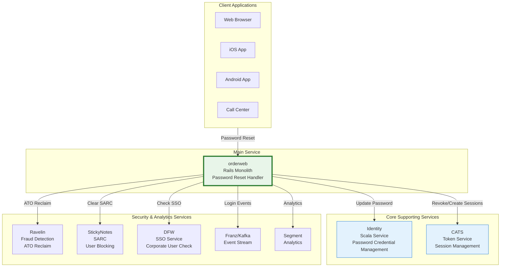

# Password Reset Flow Research: orderweb

## Executive Summary

This document maps the password reset flow in the **orderweb Rails monolith**, which handles all production password reset traffic.

**Service Overview:**
- **orderweb (Rails monolith)**: Handles 100% of production password reset traffic
  - Token generation, email sending, password update, session management
  - PostgreSQL for token storage
  - Sidekiq workers for email delivery

---

## 1. PASSWORD RESET ENDPOINTS

| Endpoint | Method | Purpose |
|----------|--------|---------|
| `/api/password_reset` | GET | Display password reset request page |
| `/api/password_reset` | POST | Initiate reset (generate token, send email) |
| `/api/password_reset/entry` | GET | Validate token and display new password form |
| `/api/password_reset/entry` | POST | Submit new password and complete reset |

---

## 2. ARCHITECTURE OVERVIEW

### 2.1 High-Level Password Reset Architecture



### 2.2 Key Components

**orderweb (Rails)**:
- `Api::PasswordResetController` - Main controller with 4 endpoints
- `PasswordResetInteractor` - Generates token and sends email
- `PasswordUpdateInteractor` - Updates password in Identity service
- `PasswordReset` model - Audit trail for reset attempts
- `User` model - Stores reset token and expiry
- `Users::PasswordResetEmailWorker` - Sidekiq worker for email delivery

**Core Services:**
- **Identity**: Password credential management, compromised password checks, password reuse detection
- **CATS**: Session token management and revocation

**Security & Analytics:**
- **Ravelin**: Fraud detection, ATO (Account Takeover) reclaim after password reset
- **StickyNotes**: SARC (Systematic Account Risk Control) checkpoint clearing
- **DFW**: SSO enablement check (blocks password reset for corporate SSO users)
- **Franz/Kafka**: Login event publishing
- **Segment**: Analytics event tracking

---

## 3. DETAILED FLOW DIAGRAMS

### 3.1 Password Reset Initiation Flow

```
1. User navigates to password reset page
2. Consumer Web App → orderweb GET /api/password_reset
3. orderweb → Returns form properties (csrf_token, tld)
4. orderweb → Segment: trigger_password_reset_page_loaded

5. User enters email and submits
6. Consumer Web App → orderweb POST /api/password_reset
   Request: { email: "user@example.com", redirect_path: "/" }

7. orderweb → User.find_by(email: email)
8. orderweb → Check if user is disabled (return 200 silently if so)
9. orderweb → DFW: Check if SSO enabled for user
   - If SSO enabled: Return 403 "SSO restriction error"

10. orderweb → PasswordReset.create_password_reset(user, country, initiator)
    - Creates record in password_resets table
    - Sets drn_id, user_id, country_id, initiator

11. orderweb → User.generate_password_reset_token!
    - Generates 64-character hex token: SecureRandom.hex(32)
    - Sets password_reset_token_expires_at = Time.now + 1.hour
    - Saves to user record

12. orderweb → PasswordResetInteractor.call()
    - Builds reset link with user_id, reset_token, correlation_id
    - Enqueues Users::PasswordResetEmailWorker

13. Users::PasswordResetEmailWorker (Sidekiq) → UserMailer.password_reset_request
    - Sends email with reset link

14. orderweb → Segment: trigger_password_reset_email_sent
15. orderweb → Returns { success_message: "Email sent to..." }
```

### 3.2 Password Reset Completion Flow

```
1. User clicks reset link in email
   URL: /password_reset/entry?user_id=123&reset_token=abc...&redirect_path=/

2. Consumer Web App → orderweb GET /api/password_reset/entry
   Query params: user_id, reset_token, correlation_id

3. orderweb → Set Referrer-Policy: no-referrer (prevent token leak)
4. orderweb → Roo::Cache::Users.find_by_id(user_id)
5. orderweb → user.valid_reset_token?(reset_token)
   - Validates: token matches AND Time.now < expires_at
   - If invalid: Redirect to password_reset with invalid_token=true

6. orderweb → Segment: trigger_password_reset_new_password_page_loaded
7. orderweb → Returns entry form properties (user_id, reset_token, tld)

8. User enters new password and confirms
9. Consumer Web App → orderweb POST /api/password_reset/entry
   Request: { user_id, reset_token, password, password_confirmation }

10. orderweb → PasswordUpdateInteractor.call()
    a. Verify reset token (user.valid_reset_token?)
    b. Verify passwords match
    c. Validate password (CreateUser::ValidateUser)
    d. Dispatch to Identity service:
       - If no identity: Create security principal + credential
       - If no credential: Add credential to existing principal
       - If exists: Update credential
    e. Identity checks:
       - Compromised password (via Ravelin)
       - Password reuse (within configured window)
       - Common password list

11. If Identity rejects password:
    - Return error: compromised/reused/common password message
    - PasswordReset.set_failed_at

12. On success:
    a. orderweb → Segment: trigger_password_reset_success
    b. orderweb → expire_sessions!(user) - Revoke all existing sessions
    c. orderweb → PasswordReset.set_sessions_destroyed_at
    d. orderweb → RavelinAtoClient.reclaim('PasswordReset', user.ravelin_id)
    e. orderweb → ClearSARCWorker.perform_async() - Clear StickyNotes checkpoint
    f. orderweb → login!(user) - Create new session
    g. orderweb → Franz: publish_login_attempt (trigger: PASSWORD_RESET)
    h. orderweb → Set logon cookie

13. orderweb → Returns { redirect_url, is_mobile_verified, email }
```

---

## 4. ENDPOINT DOCUMENTATION

### 4.1 `GET /api/password_reset`

**Purpose**: Display password reset request page

**Behavior**:
1. Check if email belongs to SSO-enabled corporate user
2. If SSO enabled: Return 403 with restriction error
3. Track page load analytics (if not `done` param)
4. Return form properties

**Query Parameters**:
- `email` (optional): Pre-fill email field
- `done` (optional): Skip analytics tracking
- `invalid_token` (optional): Show invalid token error
- `source` (optional): Track where user came from

**Response**:
```json
{
  "csrf_token": "...",
  "variant": "...",
  "tld": "co.uk",
  "reset_token": null,
  "email": "user@example.com",
  "correlation_id": "abc123"
}
```

---

### 4.2 `POST /api/password_reset`

**Purpose**: Initiate password reset - generate token and send email

**Behavior**:
1. Normalize email (downcase, strip whitespace)
2. Look up user by email
3. If user not found or disabled: Return 200 (no email sent, prevents enumeration)
4. Check SSO status via DFW
5. If SSO enabled: Return 403
6. Create `PasswordReset` record (tracks audit trail)
7. Generate reset token on User model:
   - `SecureRandom.hex(32)` = 64-character hex string
   - Expires in 1 hour
8. Build reset URL with token
9. Enqueue email worker
10. Track analytics event

**Request**:
```json
{
  "email": "user@example.com",
  "redirect_path": "/"
}
```

**Response**:
```json
{
  "success_message": "We've sent an email to user@example.com"
}
```

**Security Note**: Always returns 200 even if user not found (prevents email enumeration attacks)

**Dependencies**: DFW, PasswordReset model, User model, Sidekiq, Segment Analytics

---

### 4.3 `GET /api/password_reset/entry`

**Purpose**: Validate reset token and display new password form

**Behavior**:
1. Set `Referrer-Policy: no-referrer` (prevents token leak via Referer header)
2. Look up user by `user_id`
3. Validate reset token:
   - Token matches stored value
   - Token not expired (< 1 hour old)
4. If invalid: Redirect to password_reset with `invalid_token=true`
5. Track "new password page loaded" analytics
6. Return form properties

**Query Parameters**:
- `user_id` (required): User ID
- `reset_token` (required): 64-character reset token
- `correlation_id` (optional): For tracking

**Response (valid token)**:
```json
{
  "csrf_token": "...",
  "tld": "co.uk",
  "user_id": "12345",
  "reset_token": "abc123...",
  "correlation_id": "xyz789"
}
```

**Response (invalid token)**:
```json
{
  "redirect_url": "/password_reset?invalid_token=true&done=true"
}
```

---

### 4.4 `POST /api/password_reset/entry`

**Purpose**: Complete password reset - update password and create session

**Behavior**:
1. Look up user by `user_id`
2. Verify reset token is valid
3. Verify password matches confirmation
4. Validate password strength
5. Update password in Identity service:
   - Creates new credential if user has no Identity record
   - Adds password credential if user has Identity but no password
   - Updates existing password credential
6. Identity service checks:
   - Password not compromised (via Ravelin)
   - Password not recently used (reuse window)
   - Password not in common password list
7. On Identity rejection: Return appropriate error
8. On success:
   - Expire all existing sessions
   - Notify Ravelin of account reclaim
   - Clear StickyNotes SARC checkpoint
   - Create new session and login
   - Publish login event to Franz

**Request**:
```json
{
  "user_id": "12345",
  "reset_token": "abc123...",
  "password": "NewPassword123!",
  "password_confirmation": "NewPassword123!",
  "redirect_path": "/"
}
```

**Response (success)**:
```json
{
  "redirect_url": "/",
  "is_mobile_verified": true,
  "email": "user@example.com"
}
```

**Error Types**:
| Error | Message |
|-------|---------|
| `bad_reset_token` | Redirect to invalid token page |
| `confirm_password_mismatch` | "Passwords do not match" |
| `compromised_account` | "This password has been found in data breaches" |
| `password_reused` | "Password has been used before" |
| `common_password` | "Password is too easy to guess" |
| `invalid_password` | "Invalid password" |

**Dependencies**: Identity service, CATS, Ravelin, StickyNotes, Franz

---

## 5. MICROSERVICE DEPENDENCIES

### 5.1 Identity Service

**Purpose**: Password credential management

**Endpoints used** (via `Identity2::Client`):
- `POST /api/credentials` - Create new security principal with password
- `POST /api/security_principals/{uid}/credentials` - Add password credential
- `PATCH /api/credentials/{uid}` - Update existing password

**Password Validation Logic (Identity service)**:
1. Hash new password with bcrypt
2. Check if password is compromised (via Ravelin/Compromised Password Service)
3. Check if password was recently used (configurable window)
4. Check if password is in common password list
5. If password changed: revoke all existing sessions

**Error Responses**:
- `compromised_credential` - Password found in data breaches
- `password_reused` - Password used within reuse window
- `common_password` - Password in common password list

---

### 5.2 CATS (Consumer Auth Token Service)

**Purpose**: Session token management

**Usage in Password Reset**:
- Expire all sessions via `expire_sessions!(user)`
- Create new session after successful reset via `login!(user)`

**gRPC Endpoints**:
- `CreateToken` - Create new session after password reset
- `DeleteAllTokensByUser` - Revoke all sessions before creating new one

---

### 5.3 DFW (Deliveroo For Work/SSO Association Service)

**Purpose**: Check if user has SSO enabled

**Usage**:
- Called before allowing password reset
- Corporate users with SSO enabled cannot reset password (must use SSO)

**Method**: `sso_enabled_user?(user, 'password_reset')`

---

### 5.4 Ravelin

**Purpose**: Fraud detection and ATO (Account Takeover) handling

**Usage in Password Reset**:
- After successful password reset, notify Ravelin of "reclaim"
- Indicates user has regained control of compromised account

**Method**: `RavelinAtoClient.reclaim('PasswordReset', user.ravelin_id)`

---

### 5.5 StickyNotes Service

**Purpose**: SARC (Systematic Account Risk Control) checkpoint management

**Usage in Password Reset**:
- After successful password reset, clear any SARC checkpoints on user
- This unblocks user from restrictions that were in place

**Method**: `ClearSARCWorker.perform_async(user_id, request_path, correlation_id)`
- Worker calls `StickyNotes::ApiClient.clear_sarc_state(user_drn)`

---

## 6. TOKEN STORAGE

### 6.1 User Model Columns

- `password_reset_token`: 64-character hex string (`SecureRandom.hex(32)`)
- `password_reset_token_expires_at`: Timestamp (1 hour from generation)

**Token Generation**:
```ruby
def generate_password_reset_token!
  self.password_reset_token = SecureRandom.hex(32)
  self.password_reset_token_expires_at = Time.now + 1.hours
  save!
end
```

**Token Validation**:
```ruby
def valid_reset_token?(token)
  token &&
    password_reset_token == token &&
    Time.now < password_reset_token_expires_at
end
```

### 6.2 PasswordReset Model (Audit Trail)

| Column | Description |
|--------|-------------|
| `id` | Primary key |
| `drn_id` | Deliveroo Resource Name ID |
| `user_id` | Foreign key to user |
| `country_id` | Foreign key to country |
| `initiator` | Who initiated (e.g., "PASSWORD_RESET_CONTROLLER") |
| `requested_at` | When reset was initiated |
| `email_sent_at` | When email was sent |
| `reset_at` | When password was changed |
| `sessions_destroyed_at` | When sessions were revoked |
| `failed_at` | If reset failed |
| `skipped_at` | If reset was skipped |
| `skipped_reason` | Why (UNKNOWN, USER_DELETED, EMPLOYEE, CORPORATE_USER, NOT_SKIPPED) |

---

## 7. SECURITY CONTROLS

| Control | Implementation |
|---------|----------------|
| **SSO Check** | Via DFW - blocks reset for corporate SSO users |
| **Token Expiry** | 1 hour |
| **Token Length** | 64 characters (hex) |
| **Email Enumeration Prevention** | Silent 200 for unknown/disabled emails |
| **Compromised Password Check** | Via Identity service + Ravelin |
| **Password Reuse Check** | Via Identity service (configurable window) |
| **Common Password Check** | Via Identity service |
| **Session Revocation** | All sessions revoked on successful reset |
| **ATO Reclaim** | Ravelin notified of account recovery |
| **SARC Checkpoint Clear** | StickyNotes checkpoint cleared |
| **Referrer Policy** | `no-referrer` prevents token leak via Referer header |

---

## 8. ANALYTICS EVENTS

| Event | When | Destination |
|-------|------|-------------|
| `Password Reset Page Loaded` | User visits reset page | Segment |
| `Password Reset Email Sent` | Email successfully sent | Segment |
| `Password Reset New Password Page Loaded` | User clicks link and sees form | Segment |
| `Password Reset Success` | Password successfully changed | Segment |
| `Password Reset Failure` | Password change failed | Segment |
| `Password Reset Stickynote Checkpoint Reset Success` | SARC cleared | Segment |
| `Consumer Login Attempt` | After successful reset (forced login) | Franz |

---

## 9. CALL GRAPH

```
Api::PasswordResetController#create
  ├─> User.find_by(email: email)
  ├─> sso_enabled_user?(user, 'password_reset')
  │   └─> DFW service check
  ├─> PasswordReset.create_password_reset(user, country, initiator)
  ├─> password_reset.set_requested_at(Time.now.utc)
  └─> PasswordResetInteractor.call()
      ├─> user.generate_password_reset_token!
      │   ├─> SecureRandom.hex(32)
      │   └─> user.save!
      ├─> ConsumerWebApp::UrlHelpers.password_reset_entry_url()
      └─> Users::PasswordResetEmailWorker.perform_async()
          └─> UserMailer.password_reset_request().deliver

Api::PasswordResetController#submit_entry
  ├─> Roo::Cache::Users.find_by_id(user_id)
  ├─> PasswordReset.where(user_id: user.id).last
  └─> PasswordUpdateInteractor.call()
      ├─> verify_reset_token
      │   └─> user.valid_reset_token?(token)
      ├─> verify password == password_confirm
      ├─> CreateUser::ValidateUser.call()
      └─> dispatch_to_identity!
          ├─> Identity2::Client.create_security_principal!() [if no identity]
          ├─> Identity2::Client.create_credential!() [if no credential]
          └─> Identity2::Client.update_credential!() [if exists]
  
  On Success:
  ├─> trigger_password_reset_success()
  ├─> expire_sessions!(user)
  ├─> password_reset.set_sessions_destroyed_at()
  ├─> RavelinAtoClient.reclaim('PasswordReset', user.ravelin_id)
  ├─> ClearSARCWorker.perform_async()
  │   └─> StickyNotes::ApiClient.clear_sarc_state()
  ├─> login!(user, PASSWORD)
  └─> publish_login_attempt(user)
      └─> LogAuthenticationResult::PublishToFranz.call()
```
