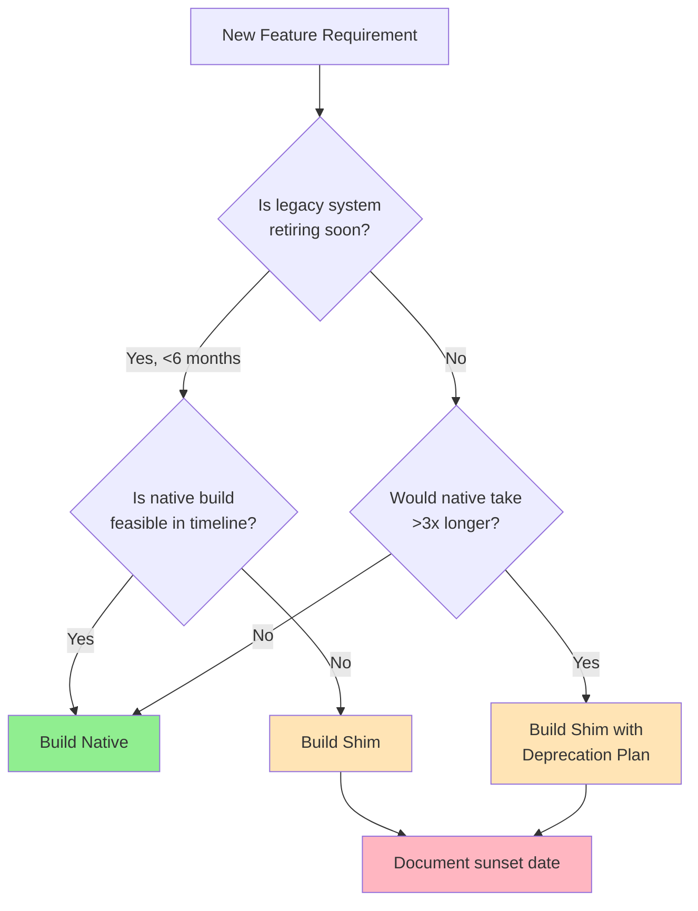
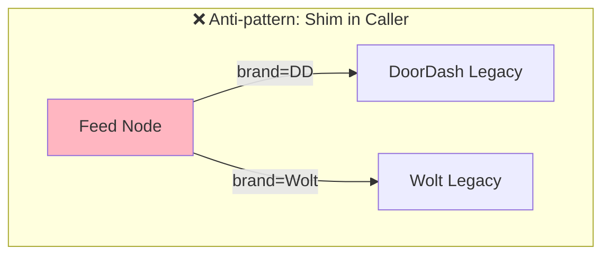
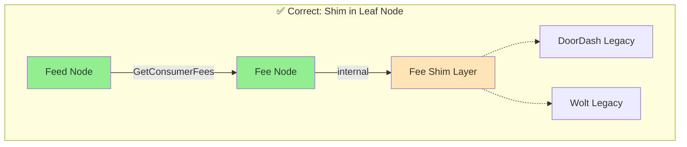
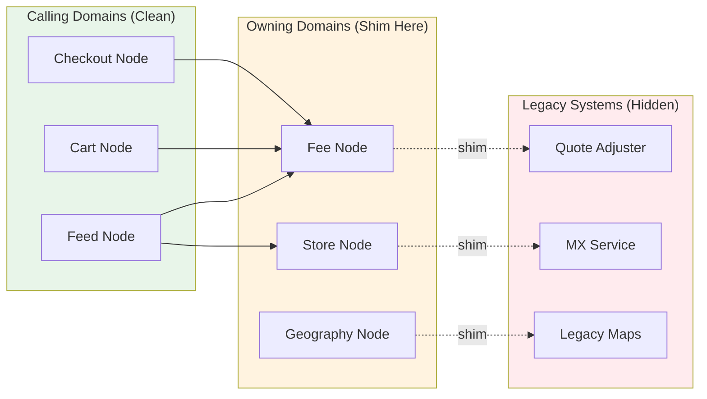
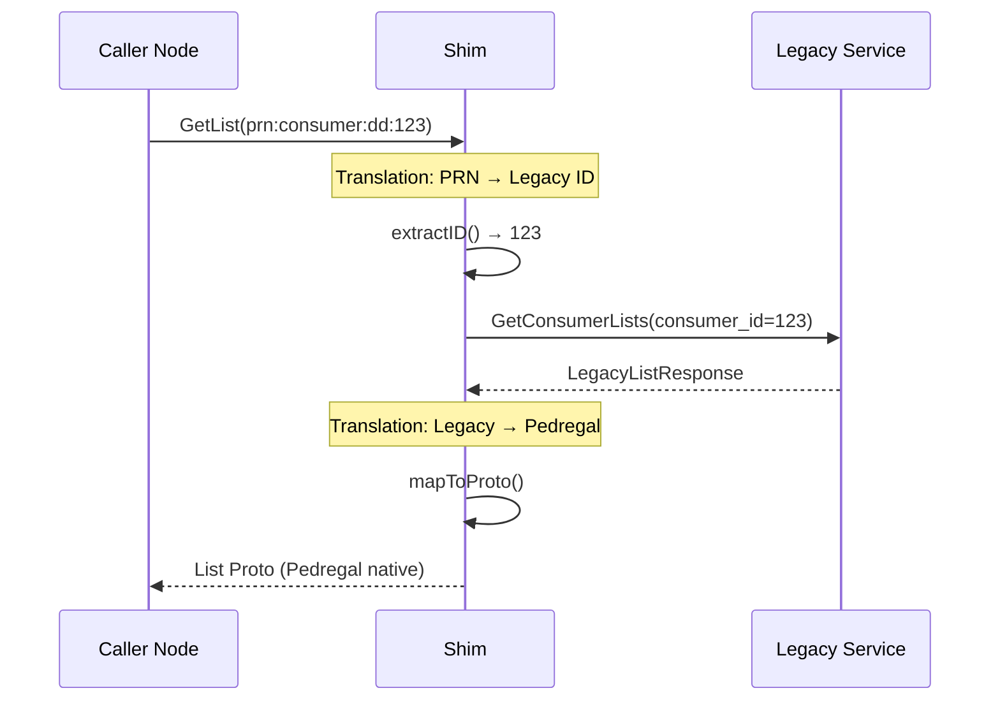
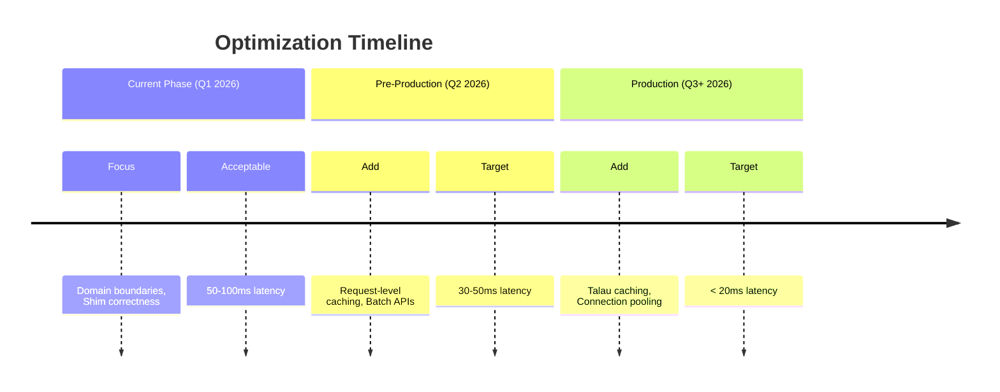
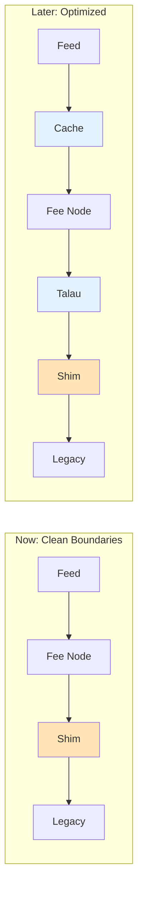

# Shim Design Principles for Pedregal

Guiding principles for building shims that bridge Pedregal to legacy services.

---

## Principle 0: Evaluate Shim vs. Native — Shims Are a Tradeoff, Not a Default

### Principle

Before implementing a shim, carefully evaluate against building natively in Pedregal. Shims are gap-closing solutions, not destinations. If timeline permits, native implementation is always preferred.

### Why

| Shim Costs | Shim Benefits |
|------------|---------------|
| Extra network hop (5-50ms) | Fast time-to-market |
| Tech debt accumulation | Incremental migration |
| Dual maintenance burden | Risk mitigation (fallback) |
| Debugging across boundaries | Parallel development |

### Example

**Scenario**: Feed node needs consumer subscription tier information.

| Approach | Timeline | Trade-off |
|----------|----------|-----------|
| Shim to DashPass service | 1 week | Fast, but adds latency + coupling |
| Native in Subscription node | 3 weeks | Clean domain model, no coupling |

**Decision**: If Feed launch is blocked and Subscription node is 2+ months out, shim is justified. Otherwise, build native.

### Visualization

---

## Principle 1: Place Shims at Leaf Nodes — Domain Isolation First

### Principle

Shims should be implemented in the domain node that owns the data, not in the calling node. This preserves domain boundaries and decouples callers from internal migration decisions.

### Why

| Shim in Caller (Bad) | Shim in Owner (Good) |
|----------------------|----------------------|
| Coupling spreads to all callers | Single point of change |
| Migration requires N caller changes | Clean interfaces for callers |
| Business logic mixes with integration | Domain team owns complexity |
| Each caller needs legacy mocking | Gradual rollout possible |

### Example

**Scenario**: Feed node needs fee breakdown for restaurants.

- **❌ Anti-pattern**: Feed node branches on brand and calls DoorDash Quote Adjuster or Wolt Pricing directly
- **✅ Correct**: Feed calls Fee node → Fee node internally shims to legacy based on brand

### Visualization

---

## Principle 2: Shims Own Entity Translation — PRNs In, Legacy IDs Out

### Principle

Shims are responsible for all conversions between Pedregal-native entities (PRNs, Pedregal geo, unified models) and legacy entities (numeric IDs, legacy coordinates, brand-specific formats). Translation logic must be encapsulated within the shim, never leaked to callers.

### Why

| Benefit | Impact |
|---------|--------|
| Single source of truth | One place to fix mapping bugs |
| Type safety | Compiler catches mismatches at shim boundary |
| Testability | Unit test translations independently |
| Audit trail | Easy to find all legacy touchpoints |

### Common Translation Patterns

| Pedregal Entity | Legacy Entity | Translation |
|-----------------|---------------|-------------|
| `prn:consumer:dd:12345` | `consumer_id: 12345` | Extract numeric suffix |
| `prn:store:wolt:abc-123` | `venue_id: "abc-123"` | Extract Wolt venue slug |
| `Location { lat, lng, h3_index }` | `{"latitude": x, "longitude": y}` | Project to legacy format |
| `Money { amount_micros, currency }` | `{"cents": 1234}` | Convert micros to cents |
| `FulfillmentType.DELIVERY` | `delivery_type: 1` | Enum to integer mapping |

### Visualization

---

## Principle 3: Defer Performance Optimization — Boundaries Over Latency (For Now)

### Principle

As of January 2026, establishing correct domain boundaries and shim architecture takes precedence over latency optimization. Performance solutions exist and can be applied incrementally as we approach production readiness.

### Why

**Current phase priorities**:
1. ✅ Correct domain modeling
2. ✅ Clean shim boundaries
3. ✅ Maintainable code structure
4. ⏸️ Sub-10ms latency (deferred)

**Why deferral is safe**:

| Concern | Available Solution | When to Apply |
|---------|-------------------|---------------|
| Extra network hop latency | Request-level caching | Pre-production |
| Repeated legacy calls | Talau (Graph Runner cache) | When APIs stabilize |
| Legacy system slowness | Caching in legacy layer | Production hardening |

**Why premature optimization hurts**:
- Caches obscure bugs during development
- Optimized code is harder to refactor
- Cache invalidation adds complexity

### Visualization

---

## Quick Reference

| Principle | One-Liner | Key Question |
|-----------|-----------|--------------|
| **0. Evaluate First** | Shims are tradeoffs, not defaults | Can we build native in time? |
| **1. Leaf Nodes** | Shim where data lives, not where it's used | Who owns this data? |
| **2. Entity Translation** | PRNs in, legacy IDs hidden | Is translation encapsulated? |
| **3. Boundaries First** | Correct now, fast later | Are we optimizing prematurely? |

---

## Related Documentation

- [Shim Examples in Pedregal](./Pedregal-shim-examples.md)
- [Sandbox Testing Guide](./sandbox-testing-guide.md)
