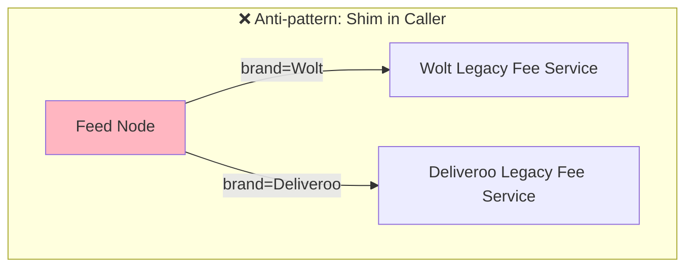
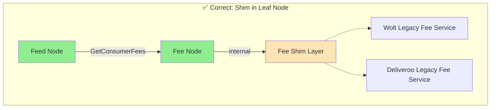
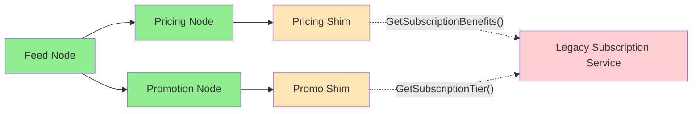

# Shim Design Principles for Pedregal

Guiding principles for building shims that bridge Pedregal to legacy services.

---

## Principle 0: Evaluate Shim vs. Native — Shims Are a Tradeoff, Not a Default

### Principle

Before implementing a shim, carefully evaluate against building natively in Pedregal. Shims are gap-closing solutions, not destinations. If timeline permits, native implementation is always preferred.

### Why

| Shim Costs | Shim Benefits |
|------------|---------------|
| Extra network hop (5-50ms) | Fast time-to-market |
| Tech debt accumulation | Incremental migration |
| Dual maintenance burden | Risk mitigation (fallback) |
| Debugging across boundaries | Parallel development |

---

## Principle 1: Place Shims at Leaf Nodes — Domain Isolation First

### Principle

Shims should be implemented in the domain node that owns the data, not in the calling node. This preserves domain boundaries and decouples callers from internal migration decisions.

### Why

| Shim in Caller (Bad) | Shim in Owner (Good) |
|----------------------|----------------------|
| Coupling spreads to all callers | Single point of change |
| Migration requires N caller changes | Clean interfaces for callers |
| Business logic mixes with integration | Domain team owns complexity |
| Each caller needs legacy mocking | Gradual rollout possible |

### Example

**Scenario**: Feed node needs fee breakdown for restaurants.

- **❌ Anti-pattern**: Feed node branches on brand and calls DoorDash Quote Adjuster or Wolt Pricing directly
- **✅ Correct**: Feed calls Fee node → Fee node internally shims to legacy based on brand

### Visualization

---

## Principle 2: Shims Own Entity Translation

### Principle

Shims are responsible for all conversions between Pedregal-native entities (PRNs, Pedregal geo, unified models) and legacy entities (numeric IDs, legacy coordinates, brand-specific formats). Translation logic must be encapsulated within the shim, never leaked to callers.

### Why

| Benefit | Impact |
|---------|--------|
| Single source of truth | One place to fix mapping bugs |
| Type safety | Compiler catches mismatches at shim boundary |
| Testability | Unit test translations independently |
| Audit trail | Easy to find all legacy touchpoints |

### Common Translation Patterns

| Pedregal Entity | Legacy Entity | Translation |
|-----------------|---------------|-------------|
| `prn:consumer:dd:12345` | `consumer_id: 12345` | Extract numeric suffix |
| `prn:store:wolt:abc-123` | `venue_id: "abc-123"` | Extract Wolt venue slug |
| `Location { lat, lng, h3_index }` | `{"latitude": x, "longitude": y}` | Project to legacy format |
| `Money { amount_micros, currency }` | `{"cents": 1234}` | Convert micros to cents |
| `FulfillmentType.DELIVERY` | `delivery_type: 1` | Enum to integer mapping |

---

## Principle 3: Embrace Redundancy — Boundaries First, Optimize Later

### Principle

As of January 2026, establishing correct domain boundaries and shim architecture takes precedence over latency optimization. Accept redundant calls and multiple shims hitting the same legacy system. Performance solutions exist and can be applied incrementally as we approach production readiness.

### Example

**Scenario**: A single Feed request triggers multiple calls to the same legacy Subscription system.

- **Pricing Node** needs subscription benefit info to calculate delivery fee discounts
- **Promotion Node** needs subscription tier to check promo eligibility

Both nodes independently call their own shims, which both hit the legacy Subscription service.

**Current state**: 2 calls to Subscription Service for one Feed request — this is fine.

**Why not dedupe now?** Pricing and Promo are separate domains. Creating shared subscription-fetching logic couples them and blurs domain boundaries.

**Later optimization**: Add request-level cache. When Pricing shim fetches subscription, cache it. When Promo shim requests it, return cached value. Zero code changes in domain nodes.

### Available Solutions (Apply Later)

| Concern | Solution | When to Apply |
|---------|----------|---------------|
| Same data fetched multiple times in one request | Request-level caching | Pre-production |
| Same data fetched across requests | Talau (Graph Runner cache) | When APIs stabilize |
| Legacy system becoming bottleneck | Caching in legacy layer | Production hardening |
| N+1 query patterns | Batch API design | Optimization sprint |

---
